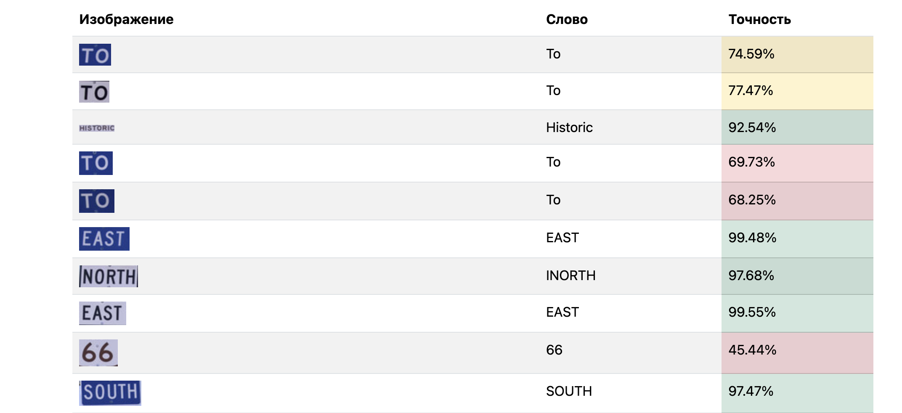

# 🧾 OCR Service with MLflow Integration

Простой веб-сервис для распознавания текста на изображениях (OCR) с использованием библиотеки [EasyOCR](https://github.com/JaidedAI/EasyOCR) и отслеживания экспериментов через [MLflow](https://mlflow.org/).

## 📸 Скриншот интерфейса




---

## 🚀 Основные технологии

| Технология | Назначение |
|-----------|------------|
| `aiohttp` | Веб-фреймворк для асинхронной обработки запросов |
| `EasyOCR` | Распознавание текста на изображениях |
| `Pillow` | Обработка изображений |
| `MLflow` | Логирование параметров, метрик, артефактов и управление моделью |
| `Docker / Docker Compose` | Упаковка приложения в контейнеры |
| `Makefile` | Автоматизация сборки, запуска и тестирования |

---

## 🧪 Интеграция с MLflow

Для управления жизненным циклом модели и логирования экспериментов используется фреймворк [MLflow](https://mlflow.org/). Он позволил:

### ✅ Что логируется:
| Категория | Данные |
|----------|--------|
| Параметры | `service_started_at`, `model_source`, `num_words`, `words` |
| Метрики   | `avg_accuracy` (средняя точность распознавания) |
| Артефакты | Изображения с выделенными словами (`highlighted.png`) |

### 📁 Как это работает:
- При старте сервиса логируется время запуска и источник модели.
- При каждом POST-запросе создаётся новый `run`, в который записываются:
  - количество найденных слов,
  - средняя точность,
  - само изображение как артефакт.

### 🎯 Зачем это нужно:
- Упрощает анализ работы модели,
- Позволяет сравнивать качество на разных входных данных,
- Упрощает отладку и аудит,
- Повышает воспроизводимость экспериментов.

---

## 🔧 Установка и запуск

### Предварительные требования:
- Docker
- Docker Compose
- Make (опционально)

### Шаги:

1. Склонируй репозиторий:
```bash
git clone https://github.com/eezimin/2025-MAI-Mlops-E-Zimin
cd ocr-service
```

2. Собери и запусти проект:
```bash
make deploy
```

3. Открой в браузере:

http://localhost:8000

4. Открой MLflow UI:

http://localhost:5001

## 🛠 CI/CD Pipeline (минимальный пример)
Для автоматизации сборки и запуска сервиса используется Makefile. Ниже приведены основные команды:

- make build — сборка Docker-образа
- make run — запуск сервиса в контейнере
- make deploy — полная сборка и запуск сервиса
- make stop — остановка всех контейнеров
- make clean — удаление Docker-образа

Этот минимальный "CI/CD" позволяет:

- Быстро разворачивать сервис,
- Автоматизировать рутинные задачи,
- Проверять качество кода перед запуском.


## ✅ Вывод
Интеграция MLflow в OCR-проект позволяет:

- Отслеживать эффективность модели в реальном времени,
- Сохранять результаты для дальнейшего анализа,
- Автоматизировать процессы тестирования и запуска сервиса.
- Также внедрена базовая автоматизация через Makefile, что может служить основой для полноценного CI/CD пайплайна.